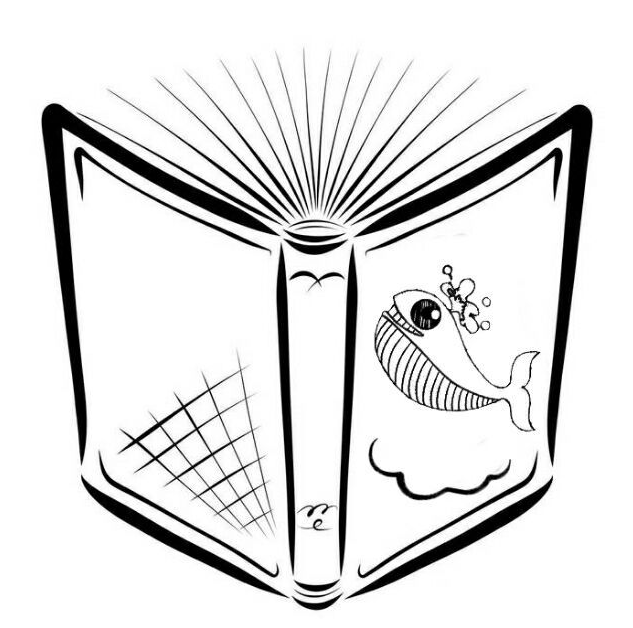
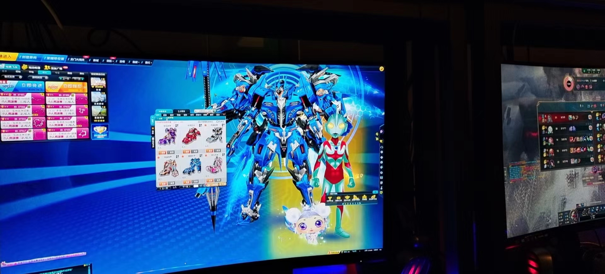

## Web

### pdf_converter_revenge
这道题是明显的cve  pdfdom
一开始看了1.2+版本的的漏洞，后面发现是2.0.0
https://www.optiv.com/insights/source-zero/blog/exploiting-rce-vulnerability-dompdf
重新定位到了CVE-2022-41343
参考 [DomPDF库反序列化RCE漏洞分析 | CTF导航 (ctfiot.com)](https://www.ctfiot.com/79602.html)
这里提到的phpggc[ambionics/phpggc: PHPGGC is a library of PHP unserialize() payloads along with a tool to generate them, from command line or programmatically. (github.com)](https://github.com/ambionics/phpggc)


### 你听说过 js 的 webshell 吗
首页源码提示扫描网站


## Misc
###  secret of bkfish
一张图片，放010无异常



stagesolve ，看不出来是给啥东西


### Ge9ian's Girl
解压后有个doc和rar
doc有隐藏文章打开就可以


```text
Sｈe lіkes Ｊａyｃhoｕ as much as І ｄｏ. Iｎ additioｎ， dｕrіｎg οｕr leiｓｕｒe ｔｉme， ｗe alsｏ lｉｋｅ to pｌay QQ Flｙіng Ϲars ｔoｇeｔheｒ． Oh， by tｈe way, ｓhｅ aｌso ｌikes ϹΤF， aｎｄ ｓｈe ｓaіd tｈat men whｏ can pｌａy ϹTF ａre ｔｈe ｍoｓt haｎdｓoｍｅ！ I often study with her, and once we learned about Twitter Secret Messages together. Do you know what this is?
```

提到了==Twitter Secret Messages ==
[Twitter Secret Messages - Steganography (holloway.nz)](https://holloway.nz/steg/)


压缩包密码 keainvren,比赛的时候少复制一个空格变成了keainvreg。。。
压缩包解压后有大量的txt，把第一个扔到010里后发现是jpg头，猜测是读取所有的txt然后拼起来


```python
with open("flag.jpg","wb") as f:  
    for i in range(1,521):  
        file_txt = f"./two/{i}.txt"  
        with open(file_txt, "rb") as ft:  
            data = ft.read()  
        f.write(data)
    
```

给图片补上文件头 FFD8FF




图片属性


密码 Ge9ian， oursecret这个是知识盲区


DASCTF{426cb864312d5e30e3eef2950ea4826c}

### 七里香

评价是以后txt要用sublime打开这样可以发现零宽


```text
This is not only a hint, but also a keyfile.
```


`tpyrcarev` 结合hint 很明显是倒过来`veracrypt` 那这个hint.txt就是密钥文件

rar有密码，结合Ge9ian 知道是《搁浅》这首歌，到2分10秒还是搁浅


压缩包密码尝试搁浅，搁浅失败，看了别的师傅wp，才知道密码是Jay和J4y交替。。。。虽然这次misc是杰伦专场但是不说谁知道啊

解压脚本直接贴了

```python
import io  
import zipfile  
  
  
with open("210.zip", "rb") as f:  
    data = f.read()  
  
all_files_processed = False  # 初始化标志变量  
  
  
count = 0  
pwds = ["J4y", "Jay"]  
while True:  
    with zipfile.ZipFile(io.BytesIO(data), "r") as zf:  
        for i in zf.filelist:  
            print(i.filename)  
            data = io.BytesIO(zf.read(i.filename, pwd=pwds[count % 2].encode()))  
            if zipfile.is_zipfile(data):  
                data = zf.read(i.filename, pwd=pwds[count % 2].encode())  
            else:  
                all_files_processed = True  
                with open(i.filename, "wb") as f:  
                    f.write(zf.read(i.filename, pwd=pwds[count % 2].encode()))  
        count += 1  
  
        if all_files_processed:  
            break
```

解出来的qlx.txt

```text
Maybe you know Ge9ian 'Girl's favorite song


Do you know Ge9ian's favorite song


He often uses the pinyin lowercase letters of this song as the password for the encryption container


Oh, by the way, it's from the same album as the following song


It rained all night, and my love overflowed like rain


The fallen leaves in the yard are thick with my longing


A few words of right and wrong cannot cool down my passion


You appear on every page of my poetry


It rained all night, and my love overflowed like rain


The butterfly on the windowsill is like a beautiful chapter flying in a poem


I will continue to write


Write loving you forever at the end of the poem


You are the only understanding I want
```

但是其实并不需要这个压缩包的解压，在前面知道是搁浅后又概率进行mp3的varecypt的搁浅尝试 
把密钥文件设置为hint.txt 密码 geqian，这里不要开TrueCrypt


挂好后有一张bmp，明显的宽高修改，且尾部又压缩包


解压后是霓虹语

```txt
まずこのtxtにはあなたが欲しいflagはありません。
でもおめでとう。フラッグにはもう近い。
あなたがflagを見つけたとき、私が用意してくれた『七里香』を聞いているかもしれません。
あ、そうだ、こっそり教えてあげる：「土犬」はとてもかわいい女の子です。
```


puzzle修复下图片


## 总结 #OURSECRET #零宽隐写
- 看了其他师傅的wp 似乎oursecret的特征是 尾部含有 `ž—º*`
- 零宽用sublime打开可以直接发现 解密网址 [Zero Width Lib (yuanfux.github.io)](https://yuanfux.github.io/zero-width-web/)

