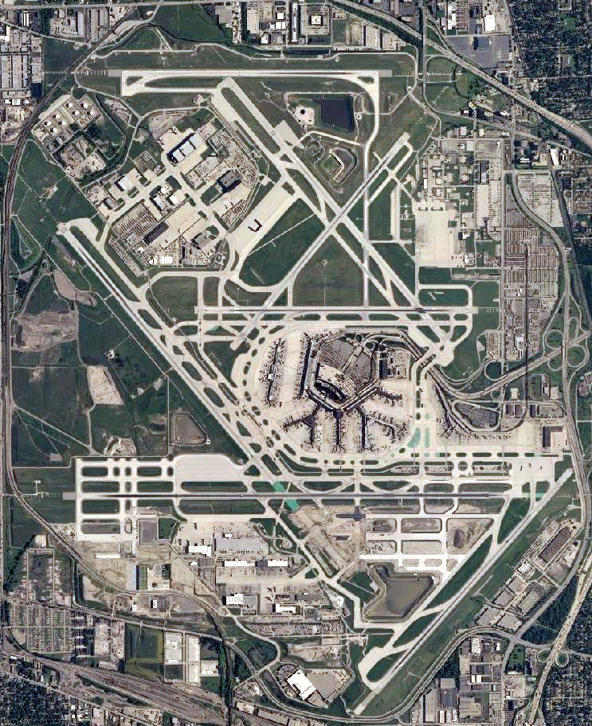

## 背景
You’re an agent with a government law enforcement agency. You’ve been tracking a group of criminal hackers known as “TufMups”. This group either keeps a low profile, your agency’s capacity to run investigations on the internet is very poor, or some combination of those two factors. Up until two days ago you had an active relationship with an informant who went by the handle “K3anu”. As you walked into your office you received a package containing a flash drive, a printed screenshot (at the top of this blog post) and a very short note.  
“Review this PCAP. It will all make sense. Woaaahhhh. – K3anu”  
That package was the last you heard from K3anu.

- 本数据包的开始时间和结束时间

- What is the hostname of the system the PCAP was recovered from? (all caps)
NBNS包中找注册

- What exact version of browser did K3anu use? (exact number only)
63.0.3239.84

- · What operating system did K3anu use? (Name and number only)

Windows NT 10.0

- How many DNS queries in the PCAP received NXdomain responses?
`dns.response_to && dns.flags.rcode !=0`过滤

-  What is the hidden message in the TufMups website? (decoded)

- What is the key to decode the secret message in the TufMups website?
base64 + xor
ftp creds are p1ggy / ripgonzo
key =0a

- How did K3anu get access to the file? (lowercase, just protocol)

FTP

- 操作者的IRC nikename
k3anu

- What is the 1st operation needed to decode the IRC users “secure” comms? (just the format name)
base64

- What is the 2nd operation needed to decode the IRC users “secure” comms? (just the format name)
ROT13

- What is the 3rd operation needed to decode the IRC users “secure” comms? (just the format name)
HEX
- What is the 4th and final operation needed to decode the IRC users “secure” comms? (2 words lowercase)
morse code

- What is the password to decrypt the zip file that was downloaded by K3anu?
爆破
fozzie
- How many total rows of “fullz” are represented in the file?
13377
- How many people in the fullz are named Joshua, have a MasterCard, and use an OS X system?
11

- What IP and port does the executable connect to? ip:port
- 

103.131.112.255 1234
- What was used to compile the malicious executable?
winscp
连接了21端口

- What executable did K3anu likely use to download files from the remote server? (exactly as written in source material)
- What is the host system’s exact BIOS version?
- What is the filename of the first file taken from K3anu’s computer?
trueidentity.zip
- What is the filename of the second file taken from K3anu’s computer?
trueidpwhelp.zip
- What utility was used to steal the files from K3anu’s computer?
ncat

- What destination port was used to steal the files from K3anu’s computer?
123 5
- What is the password to decrypt the file stolen from K3anu’s computer? (lowercase)
molder
- What is K3anu’s real identity?

- The hacker left a message for law enforcement on K3anu’s system, what was it? (message only)

yeah good luck finding this guy cops, great job picking an informant.. real winner with his grilled cheese

芝加哥奥黑尔机场
Chicago O 'Hare Airport

易卜拉欣·纳西尔国际机场（马累国际机场）
Ibrahim Nasir International Airport（Male International Airport）

MLE

ORD

MLE + ORD = molder
