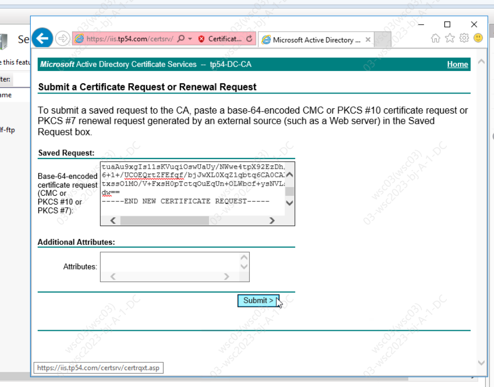

## 环境

CA环境的搭建主要是由三个角色组成

-   CA服务器
-   提供httpd，FTP等服务的服务器
-   使用相关服务的客户机

## 搭建流程

-   CA:生成自签证书
-   提供服务的服务器：生成证书请求，并将证书请求发给CA服务器
-   CA:收到发来的证书请求后签署证书，并将证书文件返回 

## 工作流程


客户端内置信任 CA 的证书信息(包含公钥)，如果CA不被信任，则找不到对应 CA 的证书，证书也会被判定非法。

## Linux系统

### openssl相关指令

**建立CA服务器**

```bash
# 生成密钥
(umask 077;openssl genrsa -out /etc/pki/CA/cakey.key 2048)
	# genrsa 生成密钥
	# ()表示此命令在子进程中运行其目的是为了不改变当前shell中的umask值
	# -out 私钥的存放路径
	# cakey.key 密钥名需与配置文件保持一致
	# 2048 密钥长度，默认为1024 2048为较为合适的密钥长度
# 自签证书
openssl req -new -x509 -key /etc/pki/CA/private/cakey.key -out /etc/pki/CA/cacert.pem -days 1000
	# req 生成证书签署请求
	# -x509 生成自签署证书
	# -days 证书的有效天数
	# -new 新请求
	# -key /path/to/keyfile 指定私钥文件
	# -out /path/to/somefile 输出文件位置
# 初始化工作环境
touch /etc/pki/CA/(index.txt,serial)
echo 01 > /etc/pki/CA/serial
	# index.txt 索引文件，用于匹配证书编号
	# serial 证书序列号文件，只在首次生成证书时赋值
```

**节点申请证书（在httpd服务器）**

```bash
# 生成密钥对
mkdir /etc/httpd/ssl
# 生成证书请求
	# -修改默认信息，简化输入，使用各节点信息一致
vim /etc/pki/tls/openssl.cnf
openssl req -new -key /etc/httpd/ssl/httpd.key -out /etc/httpd/ssl/httpd.csr
	# 命令会要求输入国家地区，城市，组织，邮箱等信息
# 将签署请求文件发送给CA服务器 
```

**签署证书（CA服务器）**

```bash
# 在CA服务器上签署证书
openssl ca -in /etc/pki/CA/csr/httpd.csr -out /etc/pki/CA/httpd.crt -days 1000
# 发送给请求者
scp httpd.crt ip:/etc/httpd/ssl
# 最后要将CA证书传给客户测试机
```

**吊销证书**

```bash
# 节点请求吊销
	# - 获取证书serial
openssl x509 -in httpd.crt -noout -serial -subject
		# x509 证书格式
		# -in 要吊销的证书
		# -noout 不输出额外信息
		# -serial 显示序列号
		# -subject 显示subject信息
# CA验证信息
	# - 节点提交的serial和subject信息来验证与index.txt文件中的信息是否一致
cat index.txt
	# - 吊销证书
openssl ca -revoke /etc/pki/CA/newcert/01.pem
		# -revoke 删除证书
	# 查看被吊销的证书列表
cat /etc/pki/CA/index.txt
	# 生成吊销证书的编号（如果是第一次吊销）
echo 00 > /etc/pki/CA/crlnumber
	# 更新证书吊销列表
openssl ca -gencrl -out ca.crl
		# -gencrl 生成证书吊销列表
```

> nginx服务端配置的时候使用的key和pem格式的证书


## Windows系统
在Server Certificates中生成证书请求，并导出


在Windows的certsrv中放入证书的生成请求




## 参考文章

https://www.cnblogs.com/yunlongaimeng/p/9417276.html

https://cloud.tencent.com/developer/article/1508268