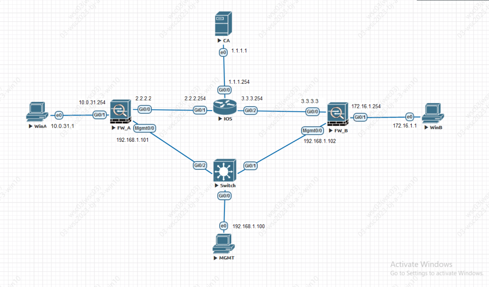

# CISCO ASA防火墙

## 相关知识

防火墙用于维护一个关于用户信息的连接表，称为Conn表，表中信息有：源ip地址、目的ip地址、ip协议（如http、ftp等）、ip协议信息（协议端口号等），防火墙能够基于特定的网络、主机和服务（TCP/UDP端口号）控制网络访问

## 网络配置

### IPSecSite2SiteVPN的搭建方法及注意事项

#### 基于CA服务器发放证书

> 只有基于证书来进行了IPSec的身份验证的才需要进行证书的申请
> 

**认证CA并获取证书**

先确定是否能ping通CA服务器，注意服务器防火墙是否放行ICMP

- 第一步先添加配置项

```bash
crypto ca trustpoint <S2S>

enrollment retry period 5

enrollment retry count 5

enrollment protocol scep url http://5.5.5.5:80/certsrv/mscep/mscep.dll
```

添加好之后对CA服务器进行验证

`crypto ca authenticate <S2S>`

认证途中会输出证书指纹，还会问是否通过验证，输入 yes 即可

配置Hostname和DNS搜索域

`hostname <name>`

`domain-name <tp54.com>`

下一步请求CA服务器颁发本服务器的证书

`crypto ca enroll <S2S>`

在申请的过程中，会请求我们输入挑战密码，这个密码可以在服务器中生成

http://`<CA>`/certsrv/mscep_admin/

输入拥有相应权限的账号后，就可以拿到挑战密码，随后输入即可

之后全部一路 yes 下去即可，如果CA服务器没开自动颁发的话需要手动颁发，ASAv会自动查询是否颁发

成功

#### 配置IKEv1（预共享密钥）

**开启IKEv1协议**

`crypto ikev1 enable OUTSIDE`

**配置IKEv1的策略**

`crypto ikev1 policy 100`

```bash
authentication rsa-sig
encryption aes-256
hash sha
group 14
lifetime 86400
```

- 这里配置了一条IKEv1策略，序号为100
- 其中认证方法用了RSA
- 加密方式使用了256位AES
- 校验算法使用了SHA
- DH算法加密等级为14
- 生命周期为一天

**配置TransformSet**

`crypto ipsec ikev1 transform-set SET esp-aes-256 esp-sha-hmac`

**配置兴趣流**

> 兴趣流，也就是需要走VPN隧道的网段，使用ACL来规定
> 

`access-list <规则序号> permit ip <需要过滤的原IP> <需要过滤的原IP的子网掩码> <需要过滤的目的IP> <需要过滤的目的IP的子网掩码>`

**配置隧道**

- tunnel-group <对端IP> type ipsec-l2l
- tunnel-group <对端IP> ipsec-attributes
- ikev1 trust-point S2S

**配置Map**

- crypto map map 1 match address <规则序号>
- crypto map map 1 set peer <对端IP>
- crypto map map 1 set ikev1 transform-set SET
- crypto map map 1 set trustpoint S2S
- crypto map map interface OUTSIDE

**（选配）NAT豁免**

> 在内网机器需要访问外网服务等情况下，进行了动态Nat转换才需要做豁免
> 

`nat (INSIDE,OUTSIDE) source static (原IP) (变换后的原IP) destination static (变换后的目标IP) (目标IP) no-proxy-arp route-lookup`

💡 ASA防火墙配置IPSec的主要流程：
	1、与CA服务器联系签发对应证书
	2、IKE协议端口和对应策略的配置
	3、IKE协议加密和校验算法的选择
	4、兴趣流的配置（ACL）
	5、隧道配置
	5、map配置
#### IKEv2的IPSec（tunnel隧道&预共享密钥)



**FW-A**

```bash
# 部署配置ike的端口区域
crypto ikev2 enable outside
# 配置ike的策略
crypto ikev2 policy 10
|-encryption aes-256
|-integrity sha256
|-group 14
|-lifetime seconds 86400
|-prf sha256
# 配置IPSec的策略
crypto ipsec ikev2 ipsec-proposal ipsec
|-protocol esp encryption aes-256
|-protocol esp integrity sha-256
# 建立实例并使用策略
crypto ipsec profile ipsec_proflie
|-set ikev2 ipsec-proposal ipsec
# 建立到对端的策略
group-policy 3.3.3.3 internal
group-policy 3.3.3.3 attributes
|-vpn-tunnel-protocol ikev2
# 配置隧道策略
tunnel-group 3.3.3.3 type ipsec-l2l
tunnel-group 3.3.3.3 general-attributes
|-default-group-policy 3.3.3.3
tunnel-group 3.3.3.3 ipsec-attributes
|-ikev2 remote-authentication pre-shared-key xxxxxxx
|-ikev2 local-authentication pre-shared-key xxxxxxx
# 配置隧道
interface tunnel 1
|-nameif ipsec_tunnel_A2B
|-ip address 10.0.0.1 255.255.255.0 # 为隧道配置的IP
|-tunnel source interface OUTSIDE
|-tunnel destination 3.3.3.3
|-tunnel mode ipsec ipv4
|-tunnel protection ipsec profile ipsec_profile
route ipsec_tunnel_A2B 172.16.1.0 255.255.255.0 10.0.0.2
```

**FW-B**

```bash
# 部署配置ike的端口区域
crypto ikev2 enable outside
# 配置ike的策略
crypto ikev2 policy 10
|-encryption aes-256
|-integrity sha256
|-group 14
|-lifetime seconds 86400
|-prf sha256
# 配置IPSec的策略
crypto ipsec ikev2 ipsec-proposal ipsec
|-protocol esp encryption aes-256
|-protocol esp integrity sha-256
# 建立实例并使用策略
crypto ipsec profile ipsec_proflie
|-set ikev2 ipsec-proposal ipsec
# 建立到对端的策略
group-policy 2.2.2.2 internal
group-policy 2.2.2.2 attributes
|-vpn-tunnel-protocol ikev2
# 配置隧道策略
tunnel-group 2.2.2.2 type ipsec-l2l
tunnel-group 2.2.2.2 general-attributes
|-default-group-policy 2.2.2.2
tunnel-group 2.2.2.2 ipsec-attributes
|-ikev2 remote-authentication pre-shared-key xxxxxxx
|-ikev2 local-authentication pre-shared-key xxxxxxx
# 配置隧道
interface tunnel 1
|-nameif ipsec_tunnel_B2A
|-ip address 10.0.0.2 255.255.255.0 # 为隧道配置的IP
|-tunnel source interface OUTSIDE
|-tunnel destination 2.2.2.2
|-tunnel mode ipsec ipv4
|-tunnel protection ipsec profile ipsec_profile
route ipsec_tunnel_B2A 10.0.31.0 255.255.255.0 10.0.0.1
```

<aside>
💡 在实验中发现似乎需要在完成动态nat转换和nat豁免后才能够实现ipsec的建立，以及注意调整相应route的优先级

</aside>

#### IKEv2的IPSec（证书）


```bash
# 部署配置ike的端口区域
crypto ikev2 enable outside
# 配置ike的策略
crypto ikev2 policy 10
|-encryption aes-256
|-integrity sha256
|-group 14
|-lifetime seconds 86400
|-prf sha256
# 配置IPSec的策略
crypto ipsec ikev2 ipsec-proposal ipsec
|-protocol esp encryption aes-256
|-protocol esp integrity sha-256
# 建立实例并使用策略
crypto ipsec profile ipsec_proflie
|-set ikev2 ipsec-proposal ipsec
# 建立到对端的策略
group-policy 57.125.98.24 internal
group-policy 57.125.98.24 attributes
|-vpn-tunnel-protocol ikev2
# 配置隧道策略
tunnel-group 57.125.98.24 type ipsec-l2l
tunnel-group 57.125.98.24 general-attributes
|-default-group-policy 57.125.98.24
tunnel-group 57.125.98.24 ipsec-attributes
|-ikev2 remote-authentication certificate 
|-ikev2 local-authentication certificate S2S
# 配置隧道
interface tunnel 1
|-nameif ipsec_tunnel_A
|-ip address 10.0.0.1 255.255.255.0 # 为隧道配置的IP
|-tunnel source interface OUTSIDE
|-tunnel destination 57.125.98.24
|-tunnel mode ipsec ipv4
|-tunnel protection ipsec profile ipsec_profile
route ipsec_tunnel_A 172.17.1.0 255.255.255.0 10.0.0.2
```

#### SSLVPN配置

**管理口的配置**

- 配置IP，标记端口名称

```bash
interface Management0/0
	no shutdown
	management-only
	nameif MGMT
	security-level 100
	ip address 192.168.1.2 255.255.255.0
```

- 开启管理界面

```bash
http server enable
http 0.0.0.0 0.0.0.0 MGMT
```

- 配置管理员用户

```bash
username <username> password <password> privilege 15
```

- 图形化配置
    - 进入ASDM后，点击上方菜单栏中的Wizards -> VPN Wizards -> AnyConnect VPN Wizards，进入SSLVPN创建流程
    - 进入第二页，链接配置，先填写配置名称，VPN配置端口选择我们的外网端口
    - 进入第三页，VPN协议，在上方的VPN协议，选择SSL和IPSec，下方的设备证书，如果有的话可以选择我们做Site2Site时使用的证书，如果没有的话可以自行颁发或自行生成
    - 进入第四页，客户端镜像，点击Add，可以先浏览一下，如果没有客户端文件包（*.pkg文件）的话，可以点击下方的Upload上传，上传过程可能会很慢，上传完毕后点击确认
    - 进入第五页，认证方法，AAA服务器我们选择本地，下方的用户数据库，可以看需求添加用户、
    - 入第六页，SAML配置，本页无需过多配置，直接下一步即可
    
    
    
    
    
    - 进入第七页，客户端IP分配，本页仅需配置IPv4地址池即可，选择IPv4地址池，点击右边按钮新建，按需分配IP地址池，分配完成后点击完成即可
    
    
    
    - 进入第八页，网络名称和域名解析，本页可以配置DNS服务器和域名称
    
    
    
    - 进入第九页，NAT豁免，如果用到了NAT可以勾选豁免
    - 然后就直接到结束即可

#### VPN兴趣流

在完成vpn的隧道的建立后，客户端可以和与其建立连接的防火墙所在网段通信。无法与建立了IPSec通道的其他网段通信。需要在防火墙上建立相关ACL策略

FW3


FW4


FW5


配置完成后仍然是无法和其他网段通信的，需要设置

`same-security-traffic permit intra-interface`

即允许端内通信，之所以无法通信其实是因为还是在那个端口上的流量，虽然防火墙为VPN虚拟了网卡，但是还是寄生在原本OUTSIDE上的，与PA上的同一个zone类似。所以需要允许端内通信

#### 模拟发包

packet-tracer input <端口区域> <包类型>

包类型

- esp
- icmp
- pcap
- rawip
- sctp
- tcp
- udp
- vlan-id


## NAT

### 应用场景

### NAT转换

- object network <Object名称>
    - subnets <需要nat的网段> <需要nat的网段的子网掩码>
    - nat (INSIDE OUTSIDE) dynamic interface

### NAT豁免

`nat (inside,outside) source static inside inside destination remote_192.168.99.0 remote_192.168.99.0 no-proxy-arp route-lookup`

想要能够ping通内网的其他机器，需要同样的在对应防火墙上做nat豁免

## ACL

### 应用场景

在内网例如DMZ在防火墙上做了静态的NAT时就需要配置允许外部主机访问对应ip的ACL

> 注意：ACL是需要通过access-group来应用到对应接口（zone）的 分为in/out 来区分在这个接口是进入防火墙还是出防火墙
> 


