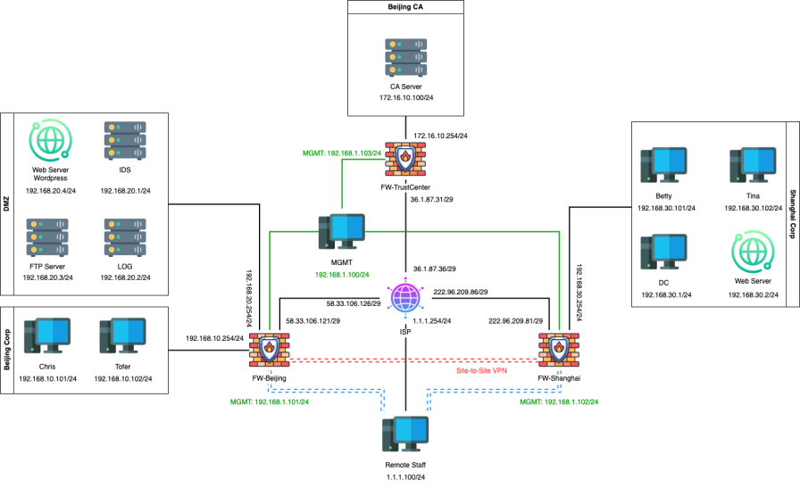

## PA防火墙

### 拓扑图



### 任务

- 在FW-Beijing 和 FW-Shanghai 之间建立IPSec VPN
- 在FW-Beijing 和 FW-Shanghai 上配置GlobalProtect以完成SSLVPN的远程接入

### 操作步骤

#### 防火墙Zones配置

Network→Interfaces→Zones

**FW-Beijing**


**********************FW-Shanghai**********************


#### 防火墙接口配置

Network→Interfaces→Ethernet

**FW-Beijing**

- ethernet1/1


- ethernet1/2


- ethernet1/3


**********************FW-Shanghai**********************

- ethernet1/1


- ethernet1/2


#### 证书的签发

DEVICE→Certificate Management→Certificates

**FW-Beijing**

- 签发一张证书并作为根证书信任 Generate


- 在这张根证书下再由其签发两张证书，分别用于IPSec和SSLVPN的配置


**FW-Shanghai**

- 与*FW-Beijing*同理


- 同样签发两张证书分别用于IPSec和SSLVPN


- 在两个防火墙选中各自信任的根证书，然后导出 Export Certificate


- 导出后通过导入来实现交换 Import


#### IPSec的配置

DEVICE→Certificate Management→Certificates Profile

- 配置 Certificate Profile


Network→Network Profiles→IKE Gateways

- 新建IKE Gateway


- IPSec Tunnels配置

Neworks→IPSec Tunnels


- 设置虚拟路由

Neworks→Virtual Routers


> FW-Shanghai配置同理
> 

#### SSLVPN的配置

- user的设置

DEVICE→Local User Database→User


- SSL/TLS Service Profile的创建

可以在使用时创建也可以通过

DEVICE→Certificate Management→SSL/TLS Service Profile


- Portals配置

Neworks→GlobalProtect→Portals


Neworks→GlobalProtect→Portals→Authentication


Neworks→GlobalProtect→Portals→Portal Data Collection


Neworks→GlobalProtect→Portals→Agent


# Paloalto与cisco的防火墙异构

在于cisco asa的防火墙建立IPSec的时候的主要步骤

- 建立相同的IKE 加密算法
- 建立相同的数据加密算法
- 在双方防火墙做感兴趣流

> 在paloalto的配置中需要设置一个proxy id的东西
似乎无法实现基于证书的IPSec通道，只能进行预共享密钥
> 

## ASA配置

```
crypto ikev1 enable OUTSIDE
crypto ikev1 policy 1 #进入ikev1规则设置
authentication pre-share
encryption aes-256
hash sha
group 14
lifetime 86400

tunnel-group <对端公网ip> type ipsec-l2l
tunnel-group <对端公网ip> ipsec-attributes
ikev1 pre-shared-key <密码>

#配置兴趣流
access-list IpVpn extended permit ip <需要过滤的原IP> <需要过滤的原IP的子网掩码> <需要过滤的目的IP> <需要过滤的目的IP的子网掩码>

crypto ipsec ikev1 transform-set SET1 esp-aes-256 esp-sha-hmac

crypto map IpMap 1 match address IpVpn

crypto map IpMap 1 set peer 1.1.1.1

#crypto map IpMap 1 set pfs group14

crypto map IpMap 1 set ikev1 transform-set SET1

crypto map IpMap interface OUTSIDE
```

## PA配置


